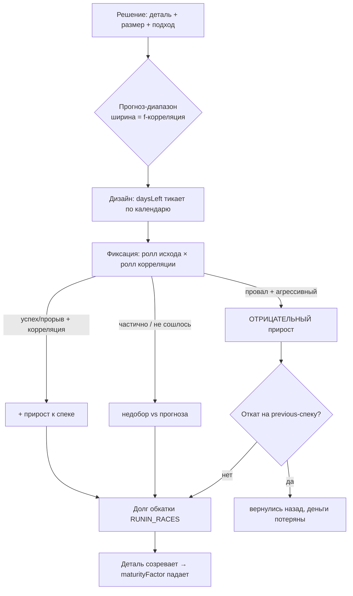
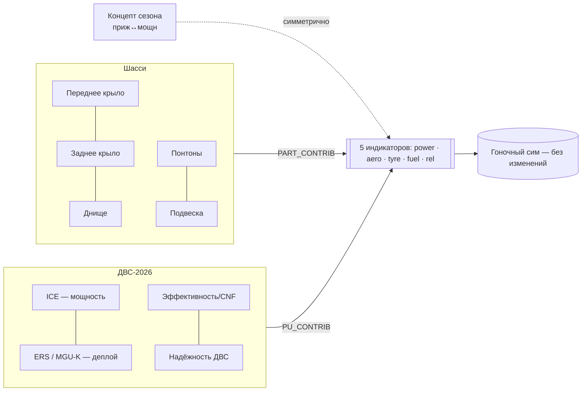
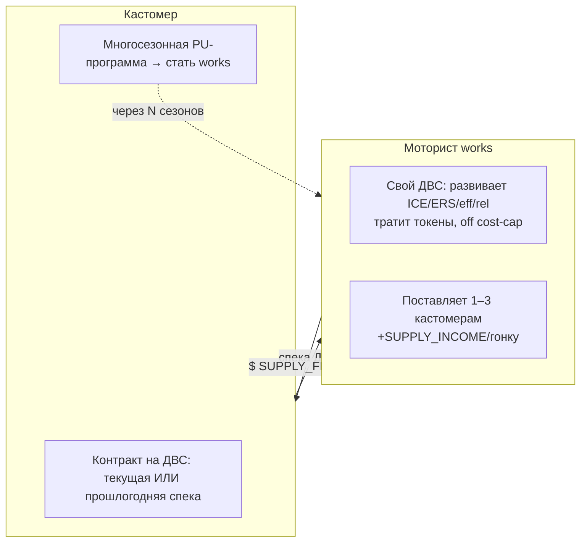
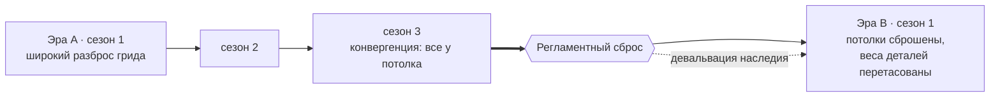
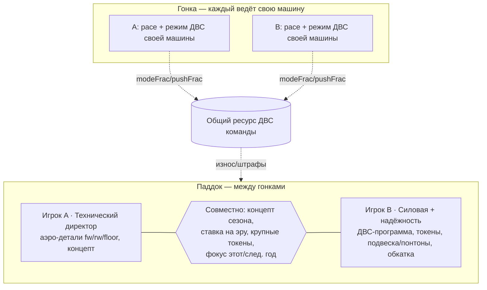
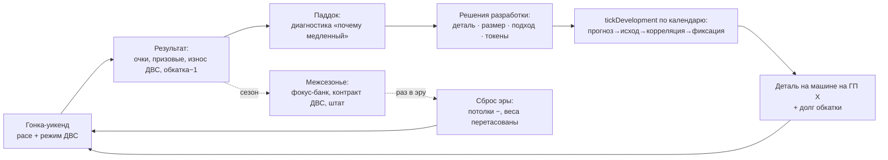

# Разработка болида, ДВС и деталей — мастер-план (Apex Web)

> **Цель документа.** Спроектировать «идеальную» логику разработки болида, силовой
> установки и деталей и весь связанный геймплей для веб-версии (Apex Web) — глубокий
> симулятор, но играбельный в коопе и в браузере. Документ опирается на то, что **уже
> реализовано** (`src/development.js`, `docs/CAR_PU_DEPTH.md`, схема сейва v22), на разбор
> чужих игр (Motorsport Manager, F1 Manager 2024, GPRO) и на то, **за что эти системы
> ругают игроки**. Ниже — честный аудит текущего состояния, целевая модель по слоям,
> конкретные формулы/коридоры, кооп-крючки, диаграммы петель и поэтапный план внедрения.

---

## 0. TL;DR — что меняем и зачем

Текущая система уже глубокая (детали → 5 индикаторов, подход риск↔надёжность, исходы,
зрелость, обкатка, концепт, ресурс ДВС, фокус этот/след. год, экономика ИИ). Но она
страдает теми же болезнями, что F1 Manager: **разработка предсказуема** («заплати → жди →
+фикс, и новая деталь никогда не хуже старой»), **нет регламентных циклов** (сезон похож
на сезон), а **ДВС-слой мельче, чем мог бы быть** под регламент 2026 (50/50 ICE+электрика).

Пять рычагов, которые превращают «калькулятор апгрейдов» в настоящую игру решений:

1. **Неопределённость и корреляция** — видишь не точное число, а *диапазон-прогноз*;
   деталь может «не сойтись с трубой» и выйти **хуже**, чем была (реверт на прошлую спеку).
2. **Регламентные эры** — раз в несколько сезонов регламент сбрасывает потолки и
   переразвешивает, какие детали/концепты важны → конвергенция грида → новый виток.
3. **Глубокий ДВС под 2026** — ICE + ERS как два под-слоя, гоночные режимы мотора,
   токены гомологации как реалистичный лимит развития, асимметрия works↔customer.
4. **Персонал как экспертиза** — ведущий конструктор «знает» детали, сужает диапазон
   прогноза и поднимает эффективный потолок (механика «known components» из MM).
5. **Кооп-разделение ролей** — два со-директора делят зоны ответственности (шасси / ДВС),
   крупные решения принимаются вместе; то, КАК каждый жмёт мотор в гонке, кормит общую
   экономику ресурса ДВС.

Всё это ложится на текущую архитектуру: влияние на сим по-прежнему идёт **только** через
5 индикаторов (`composeCar`/`applyRaceMods`), ядро сима не трогается, всё детерминировано
(сиды), кооп-безопасно.

---

## 1. Аудит: что уже есть (и где швы)

### 1.1 Сильные стороны (сохранить)

| Механика | Где | Что даёт |
|---|---|---|
| Детали → 5 индикаторов | `PARTS`, `PART_CONTRIB` | Разработка не трогает сим напрямую; чистый композитный слой |
| Подход риск↔надёжность | `APPROACH` (safe/balanced/aggressive) | Решение «сколько рискнуть» масштабирует прирост, разброс и долг надёжности |
| Исходы проекта | `projectOutcome` (провал/частично/успех/прорыв) | Сид-ролл → не детерминированный «+фикс» |
| Затухающая отдача | `maturityFactor`, `PART_CEILING=0.34` | Нет бесконечной прокачки одной детали |
| Обкатка | `unproven`, `RUNIN_RACES=3` | Свежая деталь рискует сломаться в гонке → риск реален |
| Концепт сезона | `CONCEPT` (приж/сбал/мощн), симметричный | Философия болида, взвешивается трек-характером |
| Ресурс ДВС | `PU_POOL=4`, `puWearForRace`, грид-штраф | ДВС — ограниченный ресурс сезона; пуш-режим жжёт его (E6) |
| Фокус этот/след. год | `devFocus` (F1), `nextCar` | Жертва результатом сейчас ради форы потом — самый «MM-ный» выбор |
| Экономика ИИ | ATR-догонялка + форм-свинги + концепт-фокус (E8/E9) | Грид держится плотным, у соперников «взлёты и спады» |
| Works-программа ДВС | `startPUProgram`, off-cap | Кастомер может многосезонно стать моториостом |

### 1.2 Слабые места и нестыковки (чинить)

- **«Деталь никогда не хуже».** Даже исход *провал* даёт `mult: 0.15` — это всё ещё
  **положительный** прирост. Игрок не может реально откатиться назад → нет настоящего риска,
  только «прирост поменьше». Это ровно то, за что ругают F1 Manager.
- **Прогноз слишком точен.** Игрок заранее знает `gain` детали (с поправкой на исход, но
  распределение известно). Нет тумана войны → оптимальная стратегия вычисляется, а не
  нащупывается. Опять же — главная претензия к F1M («ввёл A → всегда получишь B»).
- **Вестигиальный `buildDays`.** В `PROJECT_SIZE` есть `buildDays` (наследие двухстадийного
  пайплайна F2), но `tickDevelopment` его не использует — проект одностадийный. Мёртвое поле:
  либо осознанно вернуть стадию сборки, либо удалить. (Решение — см. §5.2.)
- **Аэро-ресурс/ATR убран у игрока, но живёт у ИИ.** В рефакторе v22 у игрока разработку
  гейтят деньги+слоты+кост-кап, а ATR-догонялка осталась только в `tickDevelopment` для ИИ.
  Ассиметрия ок как временный шаг, но игроку не хватает «честного» лимита тестов кроме денег.
- **Регламент не меняется.** Потолок `PART_CEILING` статичен, `PART_CONTRIB` фиксирован.
  Сезон-2 ≈ сезон-5 по структуре решений → повторяемость (претензия к F1M и MM).
- **ДВС мельче регламента-2026.** `PU_PARTS=[power, eff, rel]` — три ползунка. Реальный
  2026 — это 50% ICE + 50% электрика (MGU-K 350 кВт, без MGU-H, overtake-mode на 0.5 МДж).
  Сейчас энергия/ERS живёт в симе, но **не развивается** отдельно как часть мотора.
- **Кооп почти не участвует в разработке.** Разработка — «паддочное» решение, но в коде нет
  разделения зон ответственности между двумя со-директорами; оба видят один экран.

---

## 2. Уроки из чужих игр (и за что их ругают)

**Motorsport Manager** — эталон «глубины через выбор»: детали улучшают разные грани, билд
стоит деньги+штат+время, уровни до 100, редкие материалы выше. Сильная идея — **«known
components» конструктора**: ведущий дизайнер, который «знает» деталь на уровне N, строит
выше лимита завода. И **перенос лучшей детали** каждой категории в машину след. года. Три
сегмента исследований (Manufacturing → надёжность/износ, Design → всё, Aero → прижим/разгон).
Двигатель — контракт с моториостом в конце сезона. *Критика игроков:* движок слишком
поверхностный; хотят «свой ДВС как доп-доход», «прошлогодний vs новый мотор для бедных команд»,
больше глубины в in-house.

**F1 Manager 2024** — 9 деталей (6 аэро in-house + 3 узла силовой), пайплайн дизайн→
производство, часы разработки сбрасываются каждый ATR-период; завод/дизайн-центр/симуляторы
двигают скорость и потолок; CFD/труба растят экспертизу инженеров по детали. *Критика
игроков (ключевая для нас):* «ввёл A — всегда получишь B», слишком легко, КЧ берётся на 3-й
сезон любой командой по одной формуле; новые детали **никогда не хуже старых** (а в реале
инженеры ошибаются); регламент/подвеска не меняются между сезонами → быстро приедается;
ИИ развивает машину заметно медленнее игрока.

**GPRO** — браузерный, долгосрочно-стратегический: износ деталей, прогноз ресурса, планирование
апгрейдов, контракты на шины, прокачка пилота/штата в рамках бюджета; ~час в неделю. Урок для
нас: **планирование на горизонт сезона** и **старение/износ деталей** дают глубину без
микроменеджмента — идеально для веб+кооп коротких сессий.

**Сводка «что починить, чтобы не повторить их ошибки»:**

| Претензия игроков | Наш ответ (слой) |
|---|---|
| «Ввёл A → получил B», предсказуемо | Туман прогноза + корреляция (§4) |
| Детали никогда не хуже | Возможность регресса + реверт спеки (§4.3) |
| ИИ развивается медленно | Уже решено ATR-догонялкой (E8) — сохранить и докрутить (§7) |
| Регламент не меняется, приедается | Регламентные эры + сброс потолков (§6) |
| Двигатель поверхностный | Глубокий ДВС-слой 2026 + токены + works↔customer (§5) |
| Слишком легко, КЧ на 3-й сезон | Жёсткие лимиты (токены/ATR/кост-кап) + конвергенция (§6, §8) |

---

## 3. Принципы дизайна

1. **Решение, а не калькулятор.** Каждое вложение в разработку — это *ставка* с
   неопределённостью и альтернативной стоимостью, а не гарантированный +фикс.
2. **Влияние на сим — только через 5 индикаторов.** `power, aero, tyre, fuel, rel`. Любая
   новая механика композится в них (`composeCar`/`applyRaceMods`). Ядро сима неприкосновенно.
3. **Детерминизм и кооп-безопасность.** Все ролы — сид-функции от `(seed, round, part, …)`.
   Хост-авторитетный сим; разработка считается на хосте, клиент видит снапшот.
4. **Глубина из взаимосвязей, а не из числа ползунков.** Лучше 6 деталей с настоящими
   трейд-оффами, чем 40 деталей-«больше=лучше».
5. **Веб/кооп ритм.** Сессия = уикенд + короткое окно паддока. Тяжёлые решения — редкие и
   весомые (концепт, эра, токены); рутина — авто/планировщик на горизонт.
6. **Читаемость состояния.** Игрок всегда понимает, *почему* он медленный (диагностика:
   трек-характер × его профиль индикаторов) и *что* с этим делать.

---

## 4. Слой неопределённости: прогноз, корреляция, регресс

Это главный рычаг против «F1M-предсказуемости». Превращаем известный `gain` в **ставку с
туманом**.

### 4.1 Прогноз — диапазон, а не число

При запуске проекта игрок видит **прогнозный диапазон** ожидаемого прироста, а не точную
цифру. Ширина диапазона зависит от качества инфраструктуры и экспертизы штата:

```
forecast_mid   = base_gain × approach.gainK × maturityFactor(level)
forecast_width = forecast_mid × (0.55 − 0.30·corrQuality)      // 0.25…0.55 от mid
показываем:    [mid − width/2 … mid + width/2]  ( «≈ +0.018 … +0.031» )
```

`corrQuality ∈ [0,1]` — «корреляция трубы/CFD»: растёт от уровня дизайн-центра/симулятора и
от экспертизы ведущего конструктора по этой группе деталей (§5.4). Топ-команда видит узкий
диапазон (почти знает результат), нищая команда — широкий (тыкает почти вслепую). Это и есть
смысл инвестиций в инфраструктуру: **не больше прироста, а меньше неопределённости.**

### 4.2 Корреляция: «деталь не сошлась с трубой»

При фиксации (fit) кроме исхода (`projectOutcome`) катится **корреляционный ролл**: с
вероятностью `1 − corrQuality·k` деталь работает **не так, как в симуляции** — фактический
прирост сдвигается к нижней границе диапазона или ниже. Это реальное явление F1
(«part didn't correlate»). Хорошая инфраструктура снижает шанс; агрессивный подход — повышает.

```
correlated = roll > miscorrChance,  miscorrChance = clamp(0.30 − 0.25·corrQuality + 0.10·aggro, 0.03, 0.45)
if !correlated:  actual_gain = forecast_low × (0.4…0.9)        // недобор vs прогноза
```

### 4.3 Регресс и реверт спеки (детали реально бывают хуже)

Чинит претензию «новые детали никогда не хуже». На **агрессивном** подходе и при провале+
несошедшейся корреляции прирост может стать **отрицательным**: новая спека хуже предыдущей.

- Храним для детали **две спеки**: `current` и `previous` (лёгкий, не полный MM-инвентарь).
- После фиксации, если `actual_gain < 0`, деталь установлена, но игрок видит «деталь хуже
  прошлой» и может **откатиться** на `previous` спеку бесплатно (в след. окно), потеряв
  потраченные деньги/время. Откат — это и есть «болезненная цена ошибки».
- Реверт сбрасывает долг обкатки этой детали (старая спека уже обкатана).

> Баланс: отрицательные исходы редки и только на риске. Средний прогресс остаётся в
> коридоре §8 — мы добавляем **дисперсию и боль ошибки**, а не сдвигаем среднее вниз.



---

## 5. Слой деталей и ДВС: целевая структура

### 5.1 Композиция (неизменный контракт с симом)



Шесть шассийных деталей оставляем как есть (`fw, rw, floor, sidepods, susp, pu` — где `pu`
в составе шасси — это «упаковка/охлаждение мотора», не сам мотор). **Сам мотор выносим в
отдельный ДВС-слой 2026** (ниже), он композится поверх через `puToDeltas`.

### 5.2 Воронка проекта: одна осознанная стадия (+опц. сборка)

**Решение по `buildDays`:** оставляем проект **одностадийным** (дизайн → фиксация), а
`buildDays` удаляем из `PROJECT_SIZE` как мёртвое поле. Двухстадийность (дизайн→сборка)
добавляла кликов без решения. Вместо неё ту же «реалистичную задержку производства»
моделируем **датой установки = ближайший уикенд после готовности дизайна** (деталь
появляется на машине только на гонке, а не мгновенно). Это даёт ощущение «привезли апгрейд
на Гран-при X» без второй стадии-пустышки.

### 5.3 ДВС-2026: глубокий слой силовой установки

Под регламент-2026 (50% ICE + 50% электрика, MGU-K 350 кВт, без MGU-H, overtake-mode).
Расширяем `PU_PARTS` с 3 до 4 развиваемых характеристик:

| Характеристика | Композит в индикатор | Смысл |
|---|---|---|
| `ice` — мощность ДВС | `power +` | Пиковая мощность на прямых |
| `ers` — деплой/рекуперация | `power +` (через энергию/overtake) | Сколько и как часто можно «дожать» батареей |
| `eff` — эффективность (CNF) | `fuel +` | Расход/масса топлива, длина стинтов |
| `rel` — надёжность ДВС | `rel +`, ресурс | Дольше живёт юнит, меньше штрафов |

**Гоночные режимы мотора (в гонке, кооп-крючок).** Помимо pace-режима, инженер каждой машины
выбирает **режим ДВС**: `quali / race / conserve`. Спектр «мощность ↔ ресурс/SoC»:

```
quali:    power×1.05, износ ДВС ×1.6, разряд батареи быстрее   (короткие атаки/обгон)
race:     базовый
conserve: power×0.96, износ ДВС ×0.6, бережёт ресурс и SoC      (доехать на ресурсе/экономия)
```

Режим жмётся живьём → `pushFrac`/`modeFrac` копится в `sim.step` → кормит `puWearForRace`
(E6 уже делает это для push; обобщаем на режимы). **Так гонка каждого игрока влияет на общий
ресурс ДВС команды.**

**Токены гомологации — реалистичный лимит развития ДВС.** Вместо «качай ДВС сколько влезет
за деньги» вводим сезонный пул **токенов** на изменения мотора (как в реальном F1 при
заморозке/гомологации). Каждый ДВС-проект тратит токены по размеру; пул конечен → моторист
вынужден приоритизировать (мощность vs надёжность vs эффективность). Токены — это лимит,
который **нельзя купить деньгами**, в отличие от шасси. Это и закрывает претензию «слишком
легко» именно по мотору.

```
PU_TOKENS_PER_SEASON = 12   // напр.: small=2, medium=4, large=7 токена за ДВС-проект
```

### 5.4 Works ↔ Customer: асимметрия и политика поставок



- **Works** развивает свой ДВС (off cost-cap, parent-funded — как сейчас), тратит **токены**,
  зарабатывает на поставках. Может **придержать топ-спеку себе**, отдавая кастомерам спеку
  на ступень ниже (политика поставок — выбор works-игрока).
- **Customer** не развивает чужой мотор, но выбирает контракт: **текущая спека** (дороже) или
  **прошлогодняя** (дешевле, слабее) — ровно то, чего просили игроки MM («новый vs прошлогодний
  мотор для бедных команд»). Может запустить **многосезонную программу**, чтобы стать works
  (`startPUProgram` уже есть — встроить токены и спеку-наследование).
- **Связь поставщик→результат:** сильный моторист поднимает базовый `power/rel` всем своим
  кастомерам — повод выбирать поставщика стратегически (как в MM «лучший моторист → лучше звёзды»).

### 5.5 Персонал как экспертиза (механика «known components» из MM)

Ведущий конструктор и шеф-моторист несут **экспертизу по группам деталей** (аэро / механика /
ДВС). Экспертиза:

- **Сужает прогноз-диапазон** (`corrQuality`, §4.1) и снижает шанс «не сошлось» (§4.2);
- **Поднимает эффективный потолок** конкретной детали выше заводского `PART_CEILING` (строишь
  выше лимита HQ за счёт головы конструктора — прямой аналог MM «known at level N»);
- **Ускоряет** проекты этой группы (расширяем текущий `devMult`/`academyDevBonus` до
  per-area).

```
effCeiling(part)  = PART_CEILING + designer.knownBonus(partGroup)     // напр. +0.04…+0.10
corrQuality(part) = clamp(0.15·facilities.designCentre + 0.5·designer.expertise(partGroup), 0, 1)
```

Это даёт смысл трансферному рынку штата именно в контексте разработки и делает «звёздного
конструктора» осязаемым активом.

---

## 6. Регламентные эры — лекарство от повторяемости

Главный рычаг реиграбельности. Сезоны группируются в **эры** (напр. 3–5 сезонов). На стыке эр —
**регламентный сброс**, который меняет саму структуру задачи разработки.



На сбросе эры:

1. **Сброс потолков.** `PART_CEILING` обнуляет накопленный прогресс деталей (частично):
   уровни деталей умножаются на `carryFactor ≈ 0.25` — наследие переносится, но регламент его
   срезает (как в реале новый регламент обнуляет аэро-преимущество). Это **обесценивает
   «банк след. года»** ровно настолько, чтобы фокус-на-будущее (F1) оставался ставкой.
2. **Переразвешивание `PART_CONTRIB`.** Новая эра слегка меняет, какая деталь во что вносит
   (напр. в «эре днища» `floor.aero` выше, в «эре крыльев» — `fw/rw`). Сид от номера эры →
   детерминированно, но непредсказуемо для игрока заранее. Меняется **что качать в первую
   очередь** → сезоны перестают быть одинаковыми.
3. **Окно «угадай регламент».** За сезон до сброса команда может вложиться в **ранний concept
   под новую эру** (скаутинг-прогноз направления). Угадал — фора на старте эры; не угадал —
   потратил ресурс впустую. Это самый «фабрика-стратегический» выбор (реальный аналог:
   когда переключать ресурс на машину следующего регламента).

**Конвергенция внутри эры** (закрывает «слишком легко»): по мере приближения всех к потолку
`maturityFactor` душит прирост, ATR-догонялка подтягивает отстающих → **грид плотнеет к концу
эры**, и доминировать всё труднее. Сброс эры снова раскрывает разброс. Получаем естественную
синусоиду «разброс → плотность → сброс», а не монотонный отрыв лидера.

---

## 7. Разработка ИИ (сохранить и докрутить)

Текущая модель (E8/E9) уже бьёт претензию «ИИ медленный»: ATR-догонялка по живому месту
(`atr = 0.55…1.05`), форм-свинги (×0.5 / ×1.45), концепт-фокус, свой пул ДВС со штрафами.
Сохраняем; добавляем под новые слои:

- **Корреляция и регресс у ИИ** — соперники тоже иногда «не сходятся» и привозят неудачный
  апгрейд (видно в ленте новостей: «Ferrari: апгрейд днища не сработал»). Делает гонку
  непредсказуемой и «живой».
- **Токены ДВС у works-ИИ** — ограничивают их моторное развитие так же, как игрока.
- **Реакция на эру** — на сбросе ИИ-команды получают сид-«ставку угадывания регламента»:
  кто-то стартует эру сильно, кто-то проваливает первый сезон (реальные истории команд).
- **Цель — паритет среднего** с коридорами §8: добавляем дисперсию и нарратив, не сдвигаем
  средний темп прогресса.

---

## 8. Экономика и числовые коридоры

Калибруемся вокруг текущих констант (`development.js`), чтобы не сломать баланс сима.

| Параметр | Текущее | Предлагаемое | Комментарий |
|---|---|---|---|
| Кост-кап / сезон | `COST_CAP=30000` ($30M) | без изменений | Гейт шасси-разработки |
| Размеры проекта (gain) | 0.012 / 0.024 / 0.042 | без изменений | small/medium/large |
| Потолок детали | `PART_CEILING=0.34` | + `effCeiling` от конструктора | §5.5 |
| Обкатка | `RUNIN_RACES=3` | без изменений | §1.1 |
| Долг надёжности | safe/bal/aggr 0/0.012/0.032 | + `extraDebt` при регрессе | §4.3 |
| Пул ДВС | `PU_POOL=4` | без изменений | §1.1 |
| **Токены ДВС** | — | `PU_TOKENS=12`/сезон | §5.3 (новый лимит) |
| **carryFactor эры** | — | `≈0.25` | §6 (девальвация наследия) |
| Доход с поставок | `SUPPLY_INCOME=400` | + бонус за топ-спеку | §5.4 |
| ИИ-темп (база) | `AI_DEV_RATE=0.0060`/14д | без изменений (паритет) | §7 |

**Принцип калибровки:** все новые механики **дисперсионные** (меняют разброс и хвосты, не
среднее). Проверяем, что за 5 сезонов средний прогресс игрока и поля остаётся в текущем
коридоре `tools/balance.mjs`; меняется только *форма* распределения исходов (больше боли и
радости, меньше монотонности).

---

## 9. Кооп: два со-директора делят разработку

Хедлайн-фича — симметричный кооп. В паддоке разработка из «один экран на двоих» становится
**разделением зон ответственности** с обязательным согласием на крупное.



- **Раздельные слоты.** Слоты разработки (`maxProjects`) делятся: A ведёт аэро-проекты, B —
  механику/ДВС. Каждый управляет своей половиной без блокировки другого.
- **Совместные решения.** Концепт сезона, ставка на регламентную эру, крупные траты токенов,
  слайдер фокуса «этот/след. год» — требуют **согласия обоих** (UI-подтверждение от второго).
  Создаёт переговоры — суть коопа.
- **Петля гонка→экономика.** Каждый в гонке выбирает режим ДВС своей машины; суммарный износ
  бьёт по **общему** пулу/токенам команды. «Ты жёг quali-режим всю гонку — теперь нам не
  хватает ресурса на финал сезона» — настоящий повод поговорить.

---

## 10. Петля геймплея целиком



Три вложенных горизонта решений:

1. **Гонка (минуты).** Режим ДВС/pace — тратит ресурс ради позиции сейчас.
2. **Сезон (часы).** Какие детали качать, какой подход к риску, фокус этот/след. год,
   контракт/токены ДВС.
3. **Эра (несколько сезонов).** Ставка на направление нового регламента, превращение
   кастомера в моториста, долгосрочный штат.

---

## 11. План внедрения (фазы)

Каждая фаза самодостаточна, проверяема, не ломает сейвы (миграция схемы) и сим.

**P0 — гигиена (0.5 дня).** Удалить вестигиальный `buildDays`; формализовать «деталь
появляется на ближайшем уикенде»; зафиксировать аэро-ресурс-решение (деньги+слоты+кап у
игрока — задокументировать как осознанное). Тесты не падают, схема та же.

**P1 — туман и корреляция (§4.1–4.2).** Прогноз-диапазон в UI; `corrQuality` от
инфраструктуры; корреляционный ролл при фиксации. Самый дешёвый удар по «предсказуемости».
Тест: при низкой `corrQuality` дисперсия исходов выше; средний прогресс в коридоре.

**P2 — регресс и реверт (§4.3).** Отрицательные исходы на риске; хранение `previous`-спеки;
бесплатный откат. Тест: провал+агрессив может дать `gain<0`; откат восстанавливает спеку и
гасит обкатку.

**P3 — глубокий ДВС-2026 (§5.3).** `PU_PARTS → [ice, ers, eff, rel]`; гоночные режимы мотора
(обобщить E6 на режимы); токены гомологации. Тест: токен-бюджет ограничивает число ДВС-
проектов; режим quali ускоряет износ по формуле.

**P4 — works↔customer + штат-экспертиза (§5.4–5.5).** Контракт текущая/прошлогодняя спека;
политика поставок; `effCeiling`/`corrQuality` от конструктора; per-area `devMult`. Тест:
прошлогодняя спека дешевле и слабее на фикс. дельту; конструктор сужает диапазон.

**P5 — регламентные эры (§6).** Сброс потолков с `carryFactor`; переразвешивание
`PART_CONTRIB` по сид-эре; окно «ставка на регламент». Тест: на сбросе уровни ×0.25; веса
детерминированы от номера эры; грид плотнеет к концу эры (конвергенция).

**P6 — кооп-разделение ролей + планировщик (§9).** Раздельные слоты A/B; согласие обоих на
крупное; планировщик апгрейдов на горизонт сезона (GPRO-урок). Тест: слот A не блокирует B;
крупное решение требует подтверждения второго клиента (хост-авторитетно).

**P7 — ИИ-паритет и полиш (§7).** Корреляция/регресс/токены/ставка-на-эру у ИИ; новостная
лента про чужие апгрейды. Тест: средний ИИ-прогресс в коридоре; нарративные события в ленте.

---

## 12. Тест-план и инварианты

- **Детерминизм.** Тот же `(seed, round)` → тот же исход/корреляция/регресс. Юнит-тесты в
  `tests/development.test.js` расширить на новые ролы.
- **Коридоры баланса.** `tools/balance.mjs`: средний прогресс игрока и поля за 5 сезонов в
  текущем коридоре; проверяем, что новые механики двигают **дисперсию**, не среднее.
- **Контракт с симом.** Влияние только через 5 индикаторов; `clampInd` держит границы
  (`rel∈[0.3,0.995]`, прочее `[0.3,1.20]`). Сим не трогаем.
- **Кооп/неткод.** Разработка считается на хосте; крупные решения — подтверждение второго
  клиента по RPC; клиент рендерит снапшот. Нет рассинхрона (хост-авторитетный).
- **Миграция сейвов.** Каждая фаза — версия схемы (после v22): миграторы и тест round-trip с
  учётом JSON int→float квирка.
- **Регресс боя.** Инвариант сима не нарушается (бой пишет только `lapFrac`).

---

## 13. Открытые вопросы / бэклог

- **Дискретный инвентарь деталей (MM).** Сознательно НЕ вводим (у нас «уровень + потолок» +
  лёгкая `previous`-спека). Пересмотреть, если игроки захотят «возить разные крылья по трассам».
- **Шинный поставщик / контракт** (GPRO) — отдельный слой, не в этом документе.
- **Скаутинг прогноза соперников** — показать вероятный концепт/форму/ставку-на-эру ИИ.
- **Погода разработки** — дать аэро-ресурс/ATR обратно игроку как явный лимит тестов (сейчас
  только деньги+слоты+кап). Решить после P1: не дублирует ли токены/кап.
- **Глубина ERS-развития** — насколько `ers` отделять от энергии сима (сейчас энергия живёт
  в симе, развитие — через индикатор power). Калибровать на реальном движке.

---

### Источники (разбор чужих игр и регламента-2026)

- Motorsport Manager — разработка деталей и «known components»: [Parts Development (MMO Wiki)](https://motorsport-manager-online.fandom.com/wiki/Parts_Development), [Car parts (MM PC Wiki)](https://motorsportmanagerpc.fandom.com/wiki/Car_parts), [Building Your Next Year's Car (Steam Guide)](https://steamcommunity.com/sharedfiles/filedetails/?id=1089668007), [Engine discussion (Steam)](https://steamcommunity.com/app/415200/discussions/0/133261370002408542/)
- F1 Manager 2024 — разработка/исследования и критика: [Car Development & Research Guide (official)](https://www.f1manager.com/en-US/2024/news/car-development-research-guide), [Complete Car Development Guide (simracingsetup)](https://simracingsetup.com/f1-manager/f1-manager-2024-car-development/), [Research vs Design (simracingsetup)](https://simracingsetup.com/f1-manager/f1-manager-2024-research-vs-design/)
- GPRO — браузерный долгосрочный менеджмент: [What is GPRO](https://www.gpro.net/gb/whatisgpro.asp), [Game rules](https://www.gpro.net/gb/GPRORules.asp)
- Регламент 2026 (50/50 ICE+электрика, MGU-K, overtake-mode): [Formula1.com — 2026 power units](https://www.formula1.com/en/latest/article/2026-regulations-explained-all-you-need-to-know-about-f1s-new-power-units.14jfv7a36905uDJDdNyfQd), [The Race — 2026 engine rules](https://www.the-race.com/formula-1/f1-2026-new-power-unit-engine-rules-explained/)
